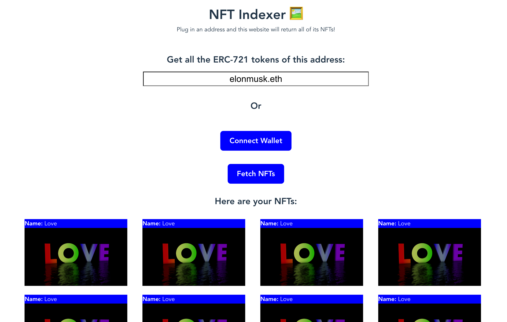

# NFT Indexer

This app displays all the NFTs owned by a specified address on the Ethereum Mainnet

- Built using React.js + Vite to serve the app with faster development times and better performance than standalone React apps
- Utilizes the Chakra UI library for the user interface to deliver an aesthetic and seamless user experience
- Leverages the Alchemy SDK to fetch a user’s NFTs quickly and efficiently
* Wallet integration supported - click and go
* Error checks for invalid addresses
* ENS support for address inputs

## To Run

1. Install dependencies by running `npm install`
2. Start application by running `npm run dev`
